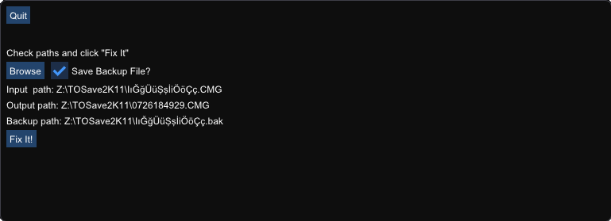

# TOSave2K11
A simple utility to fix NBA 2K11 my player files which are broken due to using "save and exit" during a timeout.

It's been almost 10 years now since the game came out and I do not know how many people care about it anymore. Still, I release it.

Actually, all that is needed to fix that glitch is to overwrite few bytes of data in the save file and to recompute checksum. Check `fix.cpp` for details.

[Dear ImGui](https://github.com/ocornut/imgui) is used for graphical user interface. Note that non-ASCII characters in file paths might not be rendered properly but it is only a rendering problem (i.e. your save files will be fixed as expected). ImGui is able to handle these characters but I did not want to waste time on that.

Have fun
